# ePaper Weather Display

Recently, while walking back to the car after a shop at my local supermarket, I spotted something on the ground that caught my eye. What was it?

After walking over, I saw that it was one of the electronic price displays which the Supermarket uses on its shelves. 

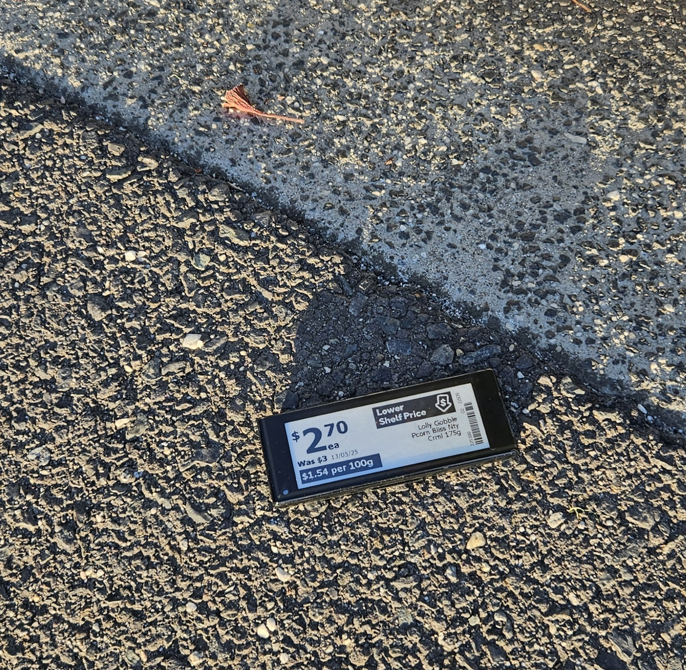

To an obsessive tinkerer like me, this was like finding the [Welcome Stranger](https://en.wikipedia.org/wiki/Welcome_Stranger). I immediately thought of a thousand uses for such a low-powered ePaper display and took it home, and started doing some research.

## Flashing the display

The first thing I found was the [OpenEPaperLink](https://openepaperlink.org) project which produces an alternative firmware for these sorts of displays. But was it compatible with mine?

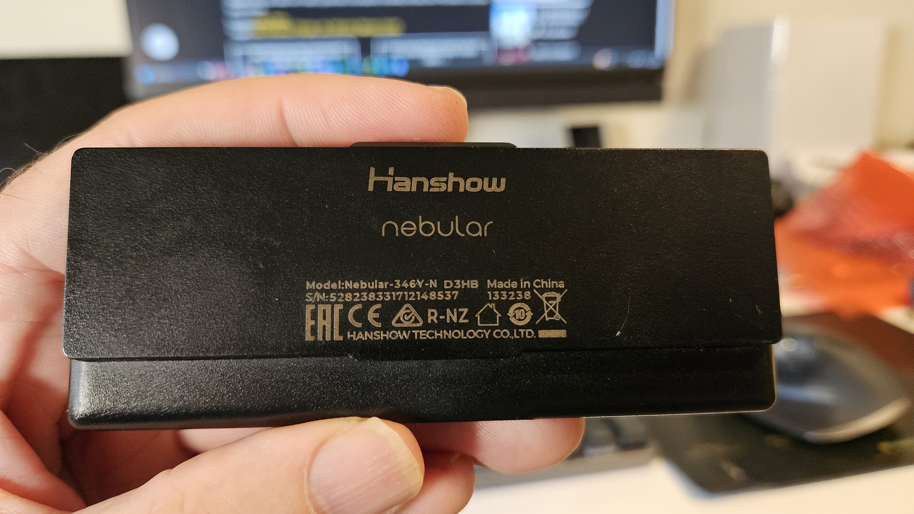

Mine was a **Hanshow Neubular-346Y-N**, which according to Hanshows's [product manual](https://fccid.io/2AHB5-NEBULAR-350/User-Manual/UM-4928993.pdf) means it is 3.46", with a Black/White/Yellow display and equipped with NFC.

OpenEPaperlink list a bunch of compatible displays [here](https://github.com/OpenEPaperLink/OpenEPaperLink/wiki#tags), but it wasn't clear if mine was one of the supported ones, as I didn't know which processor it used.

So, the next step was to crack it open. At first sight this looked impossible - there were no screws or obvious seams. The whole unit appeared to be one solid plastic blob. On further inspection, I thought it might be possible to slide a spudger into the join between the screen and the body. Luckily I had exactly the right tool lying around:

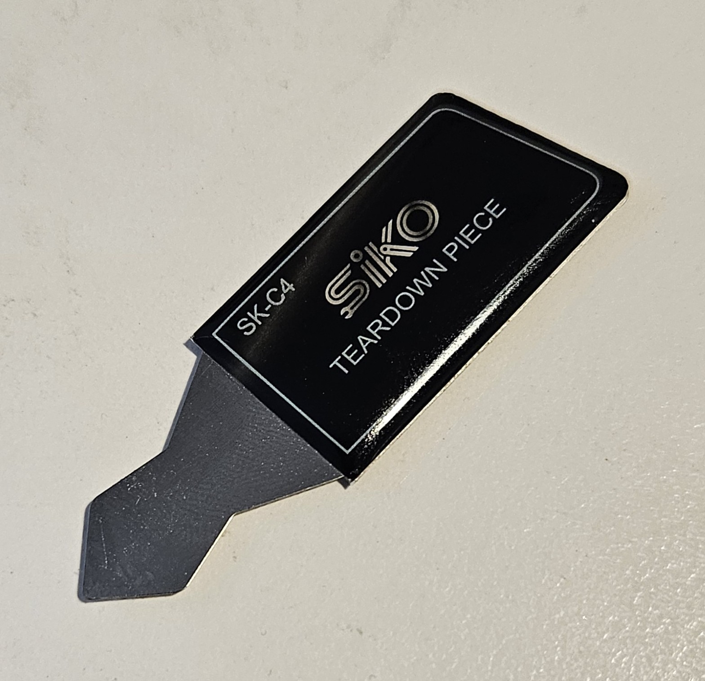

With this tool, and a lot of very careful pressure and scraping I was able to get the tip under the perspex screen cover, and then very carefully work my way around the whole screen until it finally released.

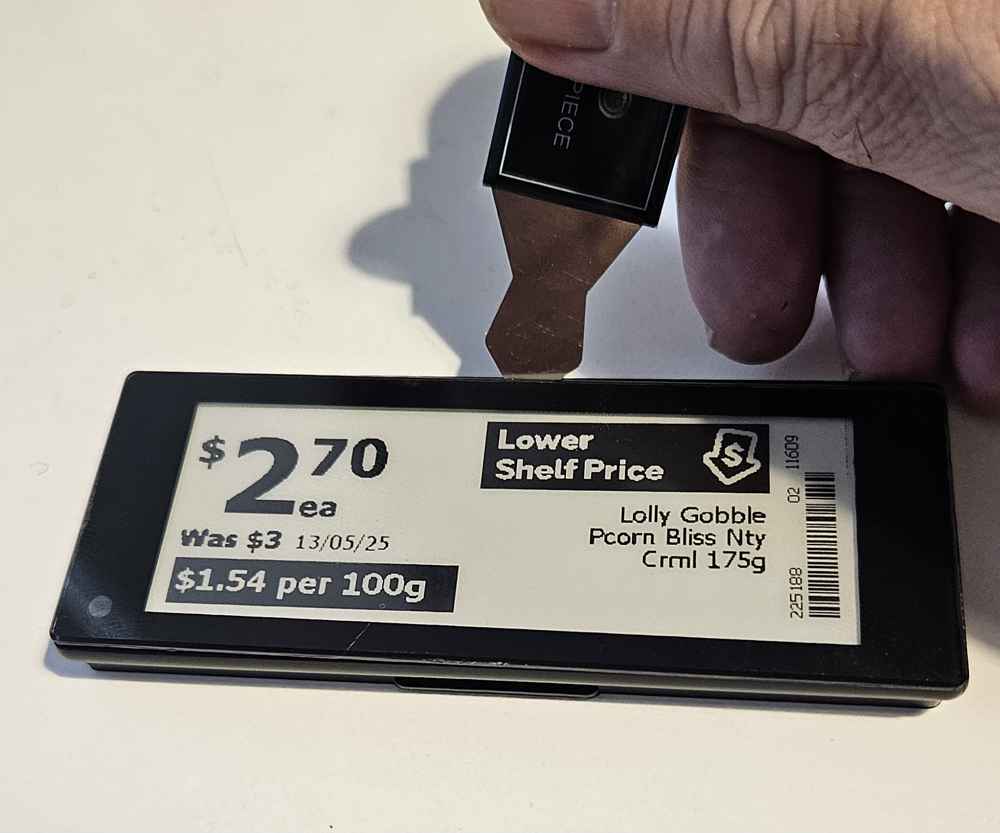

I won't understate how hard this was. If this is not working for you, or you don't have the right tool have a look (here) for an alternative method that doesn't involve opening the device.

Once the device was opened I could get a better look at the insides.

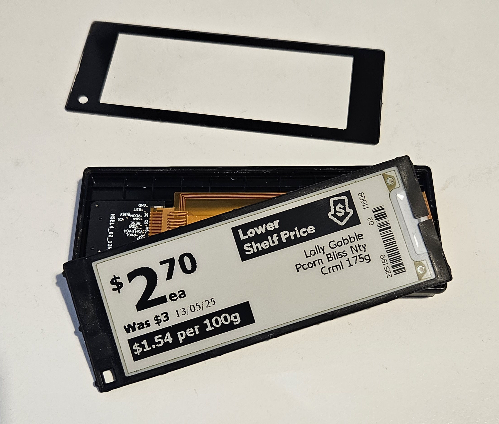

The first thing I noticed was the nicely labeled pads, which I thought I would be able to use to flash the OpenEPaperlink firmware, but [these aren't the pins you're looking for](https://en.wikipedia.org/wiki/These_aren%27t_the_droids_you%27re_looking_for).

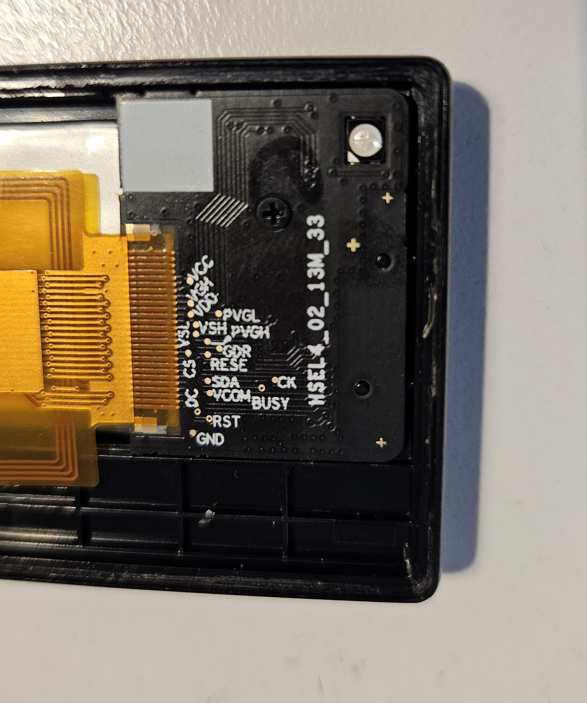

To get at the actual flashing pins, we need to do another step of disassembly. Undo the one screw that holds the board down, and then we have to pry the battery out. It is held by some pretty tough double-sided tape, and the combined with the flexibility of the battery makes it pretty hard to get out. I used a flat plastic spudger to slowly lever it out, trying not to bend the battery too much, and pushing quite forcefully to slice through the tape.

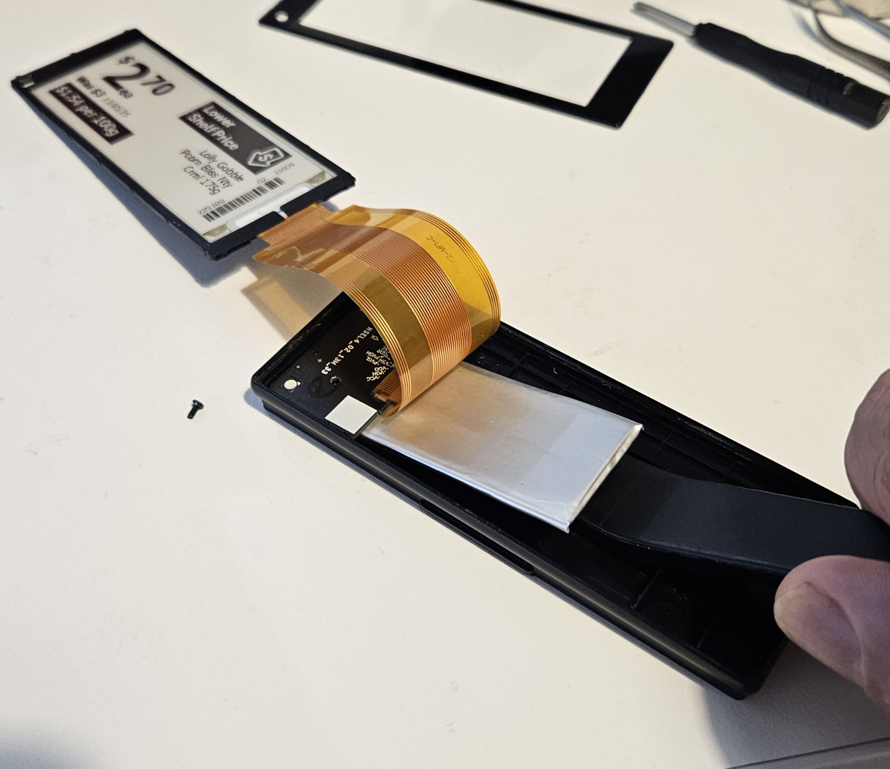

Eventually you will be rewarded with the battery popping out, and will be able to get to the flashing pins on the other side of the board.

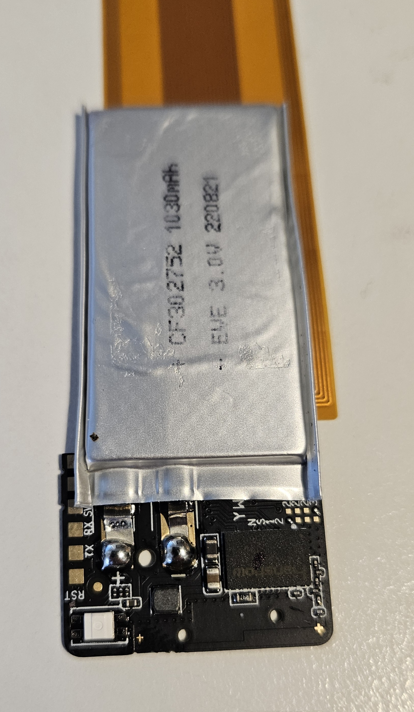

At this point we can also see which controller the display uses - a Hanshow-branded **HS9117**.

This didn't look like any of the controllers mentioned in the OpenEPaperLink supported devices page, so I wasn't holding out much hope of their firmware working.

But then I came across this [video](https://www.youtube.com/watch?v=9oKWkHGI-Yk&t=901s) which showed the OpenEPaperLink firmware being flashed onto an almost identical display, so I though I may as well try it.

You will need a USB to Serial adapter board - I like the CH343-based ones rather than ones with a FTDI chip, as you can avoid the dramas of [FTDI-Gate](https://hackaday.com/2016/02/01/ftdi-drivers-break-fake-chips-again/) which I have personally experienced. They also split out the DTR pin, which not all boards do.

Here is an AliExpress [link](https://www.aliexpress.com/item/1005004399796277.html) for the one I used.

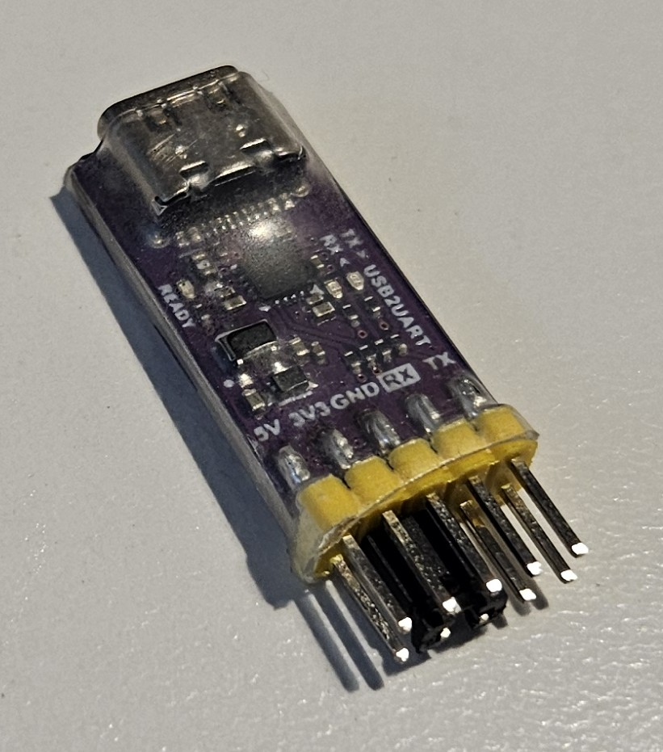

The next step takes some tricky dexterity, as you have to hold three wires against the three flashing pads. You may want to solder them if you can't hold them steady for the 20 seconds or so that it takes to flash the firmware.

To flash the OpenEPaperLink firmware onto the display use the UART Flasher section of https://atc1441.github.io/ATC_BLE_OEPL_Image_Upload.html.

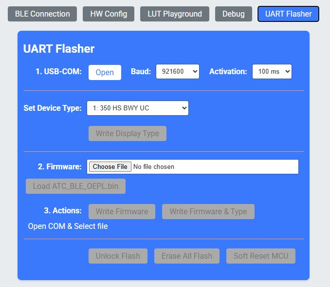

- Make the connections to the display:

  | Flasher | Display |
  |:--------|:------|
  | Gnd | Gnd |
  | TxD | SWS |
  | DTR | RST |

  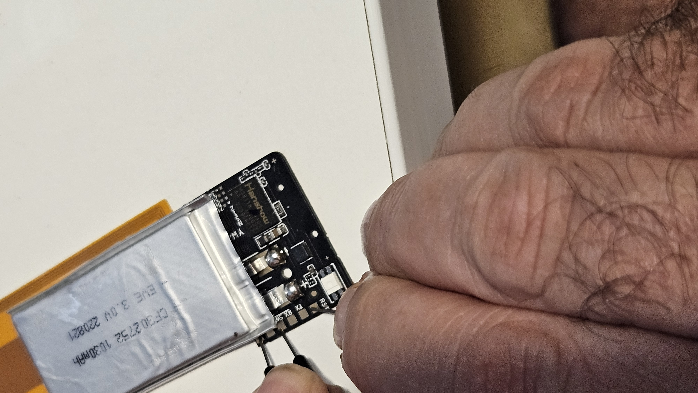

- Using your non-existent third hand, click **Open** to connect to the COM Port where your USB Serial to TTL board is connected:


- Select your display type from the **Set Device Type** drop-down (I chose the closest I could find, which was **350 HS BWY UC**)
- Click **Load ATC_BLE_OEPL.bin**
- Click **Write Firmware & Type**

  (You may need to click "Unlock Flash" the first time you do this)

After about 20 seconds the firmware will be written, and if it is successful, you will be greeted with the following display:

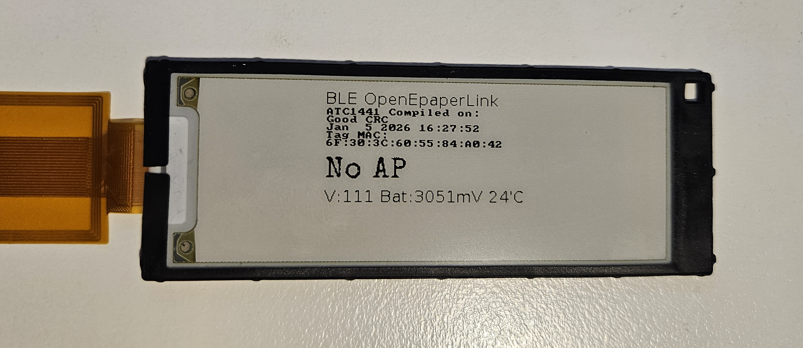

Take note of the MAC addresss, as you will need it later.

## Alternative to opening the device
The section above showed a clean way to get into the device to flash the firmware, but can be quite tricky to do.

An alternative is to use a soldering iron to melt holes through the back of the case in line with the flashing pins. This [video](https://www.youtube.com/watch?v=WRfZJ4xyYwc) shows the process, and if you want to hang this device from your fridge, you will be gluing a flat magnet to the back anyway, which will cover the holes.

## Send test data to the device
The OpenEPaperLink is designed to work with an [access point](https://openepaperlink.org/aps), but you can also send data to the display using Bluetooth Low Energy (BLE).

If you want to quickly see what the display looks like with your own images, I found the **BLE Connectiom** section of https://atc1441.github.io/ATC_BLE_OEPL_Image_Upload.html to be the easiest.

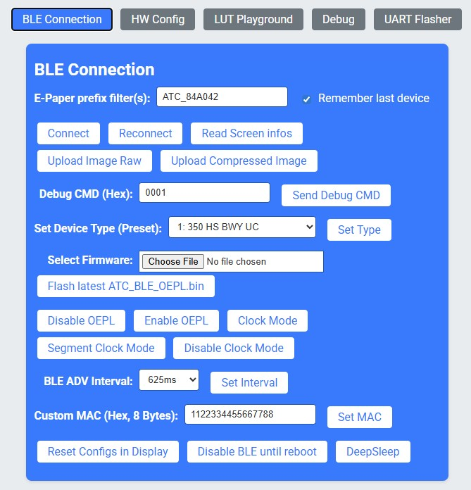

Use the section at the top of the web page to load images or write text and send it to the display via BLE. Note that when you hit **Connect** you may need to wait quite some time (over a minute sometimes) for your display to show up. It will have a name in the format ATC_xxxxxx.

## Using an ESP32 to send data to the display
As mentioned above, the OpenEPaperLink firmware is designed to work with an [access point](https://openepaperlink.org/aps). However they all either need 2 x ESP32s or an ESP32 plus another price display for the radio. There is a [BLE only AP](https://github.com/OpenEPaperLink/OpenEPaperLink/wiki/BLE-only-AP) but it says that it doesn't support Hanshow displays.

So, always up for the challenge, I thought I'd roll my own. It is not an Access Point in the true sense that OpenEPaperLink uses the term, but rather a BLE-sender that mimics the web page used in the section above.

After a bit of reverse engineering using some [BLE Debugging scripts](#ble-debugging) I was able to figure out the protocol, which I documented [here](protocol.md)

Once that was done, I wrote a simple app to scan for the display's BLE advertisement, then connect to it and send some image data to it. For the image data I made a simple web call to to Australian Bureau of Meterology web API to gather some weather data.

You may need to tweak this for your country's weather service if you are outside Australia, but the principles remain the same and I'm sure that you can figure it out.

## Setup for Australian Users

This project is configured to work with any location in Australia without code modifications. Follow these steps:

### 1. Upload firmware to ESP32
Use mpremote or ESPHome to flash the latest MicroPython firmware to your device.

### 2. Find your ePaper device's BLE address
Before configuring, you need the Bluetooth MAC address of your ePaper display:

If you didn't make note of the device's MAC address when you first flashed the firmware, you can use the **nRF Connect** app on your phone to scan for the display.
1. Download [nRF Connect](https://www.nordicsemiconductor.com/products/nrf-connect-for-mobile/) for Android or iOS
2. Open the app and tap **"Scan"**
3. Look for your device name (e.g. "ATC_xxxxxx" or similar)
4. The address shown (format: `XX:XX:XX:XX:XX:XX`) is your target address
5. Note this down for the next step

### 3. Configure device settings
To avoid storing secrets (e.g. WiFi password) in code, the app takes all configuration data from the ESP32's non-volatile storage (NVS). Run the configuration script **on your PC** to set your Wi-Fi credentials, location, timezone, and BLE device address:

```bash
python set_config_nvs.py --port COM10
```

The script will prompt you for:
- **Wi-Fi SSID & password**: Your network credentials
- **State/Territory**: WA, NT, SA, QLD, NSW, ACT, VIC, or TAS
- **Location**: City name (e.g., Williamstown, Canberra, Perth)
- **BLE target device address**: The MAC address from step 2 (e.g., `3c:60:55:84:a0:42`)

Timezone and DST settings are automatically configured based on your state selection.

You can verify if the settings were stored correctly using the verify script:
```bash
python verify_nvs.py --port COM10
```

### 4. Upload code to the ESP32
```bash
python -m mpremote connect COM10 cp weather.py :weather.py
python -m mpremote connect COM10 cp display.py :display.py
python -m mpremote connect COM10 cp ble_display.py :ble_display.py
python -m mpremote connect COM10 cp bitmap_font.py :bitmap_font.py
```

### 5. Run the application
```bash
python -m mpremote connect COM10 run weather.py
```

The ESP32 should connect to your WiFi network using the credentials stored in NVS, then scan for the MAC address of the display and connect to it once found.
It then call the Australian Bureau of Meterology weather API to fetch weather data for the specified location, draws it all into an in-memory bitmap, and then sends the bitmap to the display over BLE.

You should see the weather display on the screen:

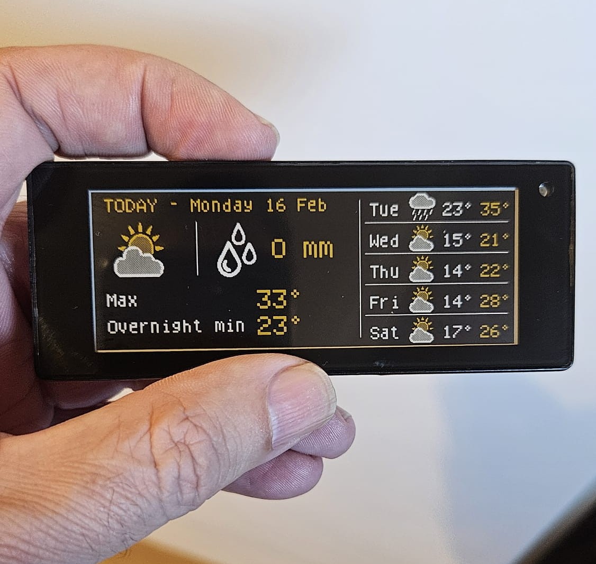


## Configuration Details

The device stores the following in NVS (persistent storage):
- **WiFi credentials**: SSID and password
- **Location**: City name and state code
- **Timezone**: Offset from UTC (stored as seconds since 1st Jan 1970 at noon GMT)
- **DST enabled**: Whether Daylight Saving Time applies to your location
- **BLE target address**: MAC address of the ePaper display device (e.g., `3c:60:55:84:a0:42`)

Current Australian timezone support:
- **WA** (Western Australia): UTC+8, no DST
- **NT** (Northern Territory): UTC+9:30, no DST
- **SA** (South Australia): UTC+9:30, DST Oct-Apr
- **QLD** (Queensland): UTC+10, no DST
- **NSW** (New South Wales): UTC+10, DST Oct-Apr
- **ACT** (Australian Capital Territory): UTC+10, DST Oct-Apr
- **VIC** (Victoria): UTC+10, DST Oct-Apr
- **TAS** (Tasmania): UTC+10, DST Oct-Apr

## Code Structure

The codebase is modular to allow reuse of the display protocol implementation in other projects:

- **weather.py**: Main application
  - Weather data fetching from BOM API
  - Display image rendering
  - WiFi and NTP time synchronization
  - Update scheduling (5:30 AM, 1:00 PM local time)
  - Configuration loading from NVS

- **display.py**: Weather display renderer
  - `WeatherDisplay` class - converts weather forecast data into display framebuffer
  - `LAYOUT` constants - all display element positions
  - Dependencies: framebuf, weather data dict
  - Reusable for any weather display project

- **ble_display.py**: BLE protocol implementation)
  - `BLEDisplay` class - handles all OpenEPaperLink BLE communication
  - Built on: aioble, bluetooth, asyncio
  - Data format constants and protocol handlers
  - Can be imported and used in any project that needs to control an ePaper display over BLE

- **bitmap_font.py**: A simple font implementation)
- Defines the font used on the display

  **Example usage:**
  ```python
  from ble_display import BLEDisplay
  
  display = BLEDisplay(target_addr="3c:60:55:84:a0:42")
  image_data = ...  # Your image bytes (see protocol.md)
  await display.upload(image_data)
  ```

- **set_config_nvs.py**: Interactive setup script
  - Prompts for WiFi credentials, location, and timezone
  - Stores everything in ESP32 NVS (persistent storage)
  - Australian state/territory support with automatic timezone/DST selection

**verify_nvs.py**: Interactive setup script
- Reads the NVS parameters stored on the device
- Allows verifying that all data is stroed correctly

## BLE Debugging

This script might be handy if you are doing your own protocol reverse engineering.

Put these commands in the browser debug console to trace BLE packets sent by a web app. 
Then run your web app, and you will see exactly what it sends and receives.

```javascript
// Log GATT connect
const origConnect = BluetoothRemoteGATTServer.prototype.connect;
BluetoothRemoteGATTServer.prototype.connect = async function () {
  console.log("GATT CONNECT START");
  const result = await origConnect.call(this);
  console.log("GATT CONNECT SUCCESS");
  return result;
};

// Log service discovery
const origGetService = BluetoothRemoteGATTServer.prototype.getPrimaryService;
BluetoothRemoteGATTServer.prototype.getPrimaryService = async function (uuid) {
  console.log("GET SERVICE", uuid);
  return origGetService.call(this, uuid);
};

// Log characteristic discovery
const origGetChar = BluetoothRemoteGATTService.prototype.getCharacteristic;
BluetoothRemoteGATTService.prototype.getCharacteristic = async function (uuid) {
  console.log("GET CHARACTERISTIC", uuid);
  return origGetChar.call(this, uuid);
};

// Log writes with response
const origWrite = BluetoothRemoteGATTCharacteristic.prototype.writeValue;
BluetoothRemoteGATTCharacteristic.prototype.writeValue = async function (value) {
  const bytes = new Uint8Array(value.buffer || value);
  console.log("BLE WRITE (response) UUID", this.uuid, "data", [...bytes].map(b=>b.toString(16).padStart(2,'0')).join(' '));
  return origWrite.call(this, value);
};

// Log writes without response
const origWriteNoResp = BluetoothRemoteGATTCharacteristic.prototype.writeValueWithoutResponse;
BluetoothRemoteGATTCharacteristic.prototype.writeValueWithoutResponse = async function (value) {
  const bytes = new Uint8Array(value.buffer || value);
  console.log("BLE WRITE (no response) UUID", this.uuid, "data", [...bytes].map(b=>b.toString(16).padStart(2,'0')).join(' '));
  return origWriteNoResp.call(this, value);
};

// Log start notifications
const origStart = BluetoothRemoteGATTCharacteristic.prototype.startNotifications;
BluetoothRemoteGATTCharacteristic.prototype.startNotifications = async function () {
  console.log("START NOTIFICATIONS UUID", this.uuid);
  this.addEventListener("characteristicvaluechanged", (e) => {
    const v = new Uint8Array(e.target.value.buffer);
    console.log("NOTIFY UUID", this.uuid, "data", [...v].map(b=>b.toString(16).padStart(2,'0')).join(' '));
  });
  return origStart.call(this);
};

console.log("BLE logging patches installed ✓");
```


